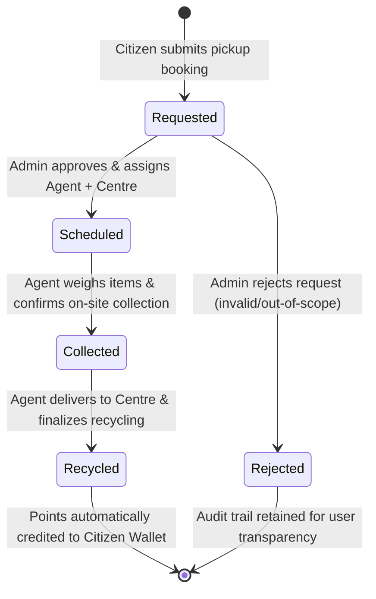
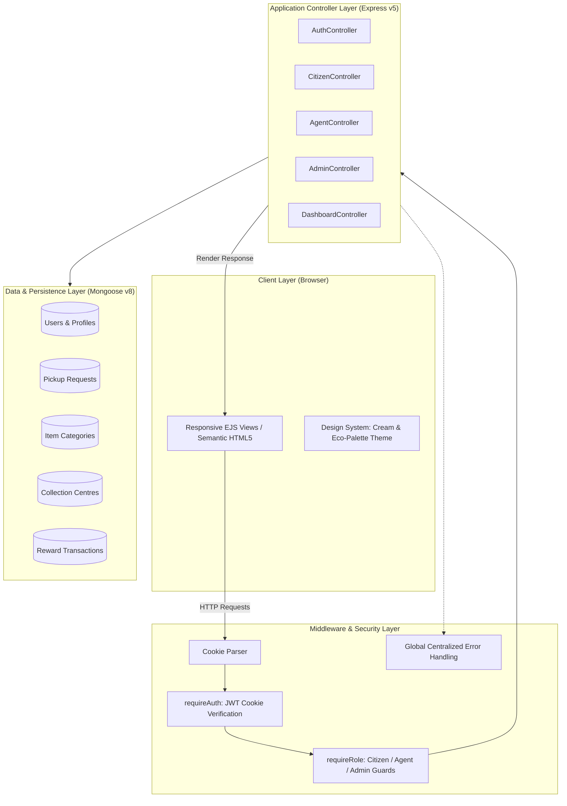

<div align="center">

# 🌿 EcoPickup
### Smart E-Waste Management & Community Reward Ecosystem

[](https://nodejs.org/)
[](https://expressjs.com/)
[](https://www.mongodb.com/)
[](https://mongoosejs.com/)
[](https://jwt.io/)
[](LICENSE)
[](https://github.com/Rewaskc02-lang/EcoPickup/pulls)

<p align="center">
  <b>A full-stack, role-based platform modernizing electronic waste disposal through community recycling incentives, verified doorstep collection, and real-time lifecycle tracking.</b>
</p>

[Explore Features](#-core-features) •
[Architecture](#-system-architecture) •
[State Machine](#-pickup-lifecycle--state-machine) •
[Installation](#-getting-started) •
[Route Reference](#-route-directory) •
[Contributing](#-contributing)

</div>

---

## 📌 Overview

Global electronic waste (e-waste) is among the fastest-growing solid waste streams in the world, laden with both hazardous materials (lead, mercury, cadmium) and recoverable precious metals (gold, silver, copper). Improper disposal results in toxic landfill leaching and environmental degradation.

**EcoPickup** solves this challenge by providing a transparent, decentralized collection pipeline:
- **Citizens** schedule hassle-free doorstep pickups and receive tangible reward points based on verified item weight and category.
- **Collection Agents** operate in the field with route queues, weighing items on-site and completing verified handoffs to registered processing centers.
- **Administrators** control facility logistics, approve incoming collection requests, balance agent workloads, and tune reward rates per category.

---

## 🚀 Core Features

### 👤 Citizen Portal
* **One-Click Booking:** Book doorstep e-waste pickups by selecting categories (batteries, mobiles, appliances, cables), estimated weights, preferred dates, and operational zones.
* **Real-Time Request Tracker:** Track status transitions dynamically (`Requested` $\rightarrow$ `Scheduled` $\rightarrow$ `Collected` $\rightarrow$ `Recycled`).
* **Detailed Request Inspections:** View assigned agent details, contact info, destination facility, and final measured weights.
* **Eco-Reward Wallet:** Accumulate reward points credited upon successful recycling, with a complete audit history and simulated voucher redemption.

### 🚚 Field Agent Console
* **Assigned Dispatch Queue:** View all scheduled collections prioritized by preferred date and operational zone.
* **On-Site Scale Verification:** Enter physical scale weight (`actualWeightKg`) at collection, replacing citizen estimates.
* **Facility Recycling Handoff:** Finalize processing at authorized collection centres, instantly calculating points and updating citizen wallets.

### 🛡️ Administrator Command Center
* **Executive Metrics Dashboard:** Overview of total requests, completion rates, category distributions, registered centers, and field agents.
* **Request Triage & Dispatch Queue:** Review pending citizen submissions, assign qualified field agents, allocate target facilities, or reject invalid requests with audit logs.
* **Category Management (CRUD):** Define e-waste categories, descriptions, and dynamic reward conversion rates (points/kg).
* **Collection Centre Management (CRUD):** Manage authorized physical facilities, operational capacities (in metric tons), contact numbers, and service zones.

---

## 🔄 Pickup Lifecycle & State Machine

Every pickup request moves through a strict, tamper-proof state machine managed across all three system roles:



---

## 🏗️ System Architecture

Built on an enterprise Model-View-Controller (MVC) architectural pattern:



---

## 💎 Reward Calculation Engine

Reward points are dynamically minted when an agent marks a pickup as **Recycled**:

$$\text{Reward Points Earned} = \text{round}\left(\text{Actual Measured Weight (kg)} \times \text{Category Rate (Points/kg)}\right)$$

### Default Pre-Seeded Rates

The database automatically seeds 4 primary categories upon first launch:

| Category | Reward Rate | Description & Environmental Rationale |
| :--- | :---: | :--- |
| 🔋 **Batteries** | `200 pts/kg` | Lithium-ion, lead-acid, and dry cells requiring hazardous containment. |
| 📱 **Mobiles & Tablets** | `150 pts/kg` | High-value electronics containing precious metals (gold, palladium, copper). |
| 📺 **Appliances** | `50 pts/kg` | Microwaves, toasters, televisions, vacuum cleaners, and small electronics. |
| 🔌 **Cables & Wiring** | `40 pts/kg` | Power adapters, USB cables, HDMI cords, and high-purity copper wiring. |

---

## 🎨 Design System & Visual Palette

EcoPickup adopts a custom, tactile aesthetic inspired by sustainable materials and editorial printing:

* **Warm Neutral Foundation:** `#F6F2E9` (Cream Canvas), `#FFFDF9` (Card Panels), `#E2DCC8` (Subtle Borders).
* **Role-Adaptive Theme Accents:**
  * 🌿 **Citizen Portal:** Moss Green (`#7A8B5D`) — Welcoming, community-oriented.
  * 🌊 **Field Agent:** Teal Pine (`#4E7C74`) — Functional, dispatch-oriented.
  * 🌲 **Admin Command:** Deep Forest (`#3F5C43`) — Authoritative, operational.
* **Typography:** `IBM Plex Mono` for weights, IDs, and financial tokens; `Inter` for intuitive UI controls; `Lora` for expressive editorial headings.

---

## 📂 Project Structure

```bash
ewaste-pickup-system/
├── config/
│   └── db.js                  # MongoDB Atlas connection & auto-category seeder
├── controllers/
│   ├── adminController.js     # Dispatch, queues, category & centre management
│   ├── agentController.js     # Assigned pickup management, scale weigh-in, handoff
│   ├── authController.js      # JWT authentication, signup, login, cookie sessions
│   ├── citizenController.js   # Booking forms, tracking, and wallet transactions
│   └── dashboardController.js # Multi-role dashboard aggregators
├── middleware/
│   ├── authMiddleware.js      # JWT extraction, verification, & session attachment
│   ├── errorMiddleware.js     # Global error handling and graceful fallbacks
│   └── roleMiddleware.js      # Role-Based Access Control (RBAC) authorization
├── models/
│   ├── collectionCentreModel.js # Facility schema (capacity, location, zone)
│   ├── itemCategoryModel.js     # Category schema (reward multiplier, specs)
│   ├── pickupRequestModel.js    # Core state machine schema & references
│   ├── rewardTransactionModel.js# Ledger schema for earned/redeemed credits
│   └── userModel.js             # User accounts, hashed passwords, roles & wallet
├── public/
│   └── css/
│       └── style.css          # Cream & Eco-Green design system and micro-interactions
├── routes/
│   ├── adminRoutes.js         # /admin/* endpoints
│   ├── agentRoutes.js         # /agent/* endpoints
│   ├── authRoutes.js          # Authentication & session routes
│   ├── citizenRoutes.js       # /citizen/* booking & wallet routes
│   └── dashboardRoutes.js     # Role redirector & dashboard dispatchers
├── views/
│   ├── admin/                 # Admin views (dashboard, requestQueue, categories, centres)
│   ├── agent/                 # Agent views (dashboard, assignedPickups)
│   ├── auth/                  # Auth views (login, register)
│   ├── citizen/               # Citizen views (dashboard, bookPickup, myRequests, wallet)
│   ├── partials/              # Modular navigation bars & shared footer
│   └── error.ejs              # Contextual error page
├── .env.example               # Template for environment variables
├── .gitignore                 # Excluded directories and credentials
├── app.js                     # Main Express application entrypoint
├── package.json               # Dependencies and execution scripts
└── README.md                  # Project documentation
```

---

## 🛠️ Tech Stack

* **Runtime:** [Node.js](https://nodejs.org/) (v18.x or higher)
* **Web Framework:** [Express.js](https://expressjs.com/) (v5.x)
* **Database & ODM:** [MongoDB Atlas](https://www.mongodb.com/atlas) with [Mongoose](https://mongoosejs.com/) (v8.x)
* **View Engine:** [EJS (Embedded JavaScript)](https://ejs.co/)
* **Authentication:** [JSON Web Tokens (jsonwebtoken)](https://github.com/auth0/node-jsonwebtoken) with `httpOnly` secure cookies
* **Password Encryption:** [bcryptjs](https://github.com/dcodeIO/bcrypt.js)
* **Styling:** Custom Vanilla CSS Design System with CSS Custom Properties

---

## ⚡ Getting Started

Follow these steps to run EcoPickup locally on your machine.

### Prerequisites
* **Node.js** (v18.0.0 or higher) — [Download Node.js](https://nodejs.org/)
* **npm** (v9.0.0 or higher)
* **MongoDB** connection string (either [MongoDB Atlas](https://cloud.mongodb.com/) or a local MongoDB instance).

### 1. Clone the Repository
```bash
git clone https://github.com/Rewaskc02-lang/EcoPickup.git
cd EcoPickup
```

### 2. Install Dependencies
```bash
npm install
```

### 3. Configure Environment Variables
Copy the `.env.example` file to `.env`:
```bash
cp .env.example .env
```
Open `.env` in your text editor and provide your configuration:
```env
PORT=3000
NODE_ENV=development
MONGO_URI=mongodb+srv://<username>:<password>@cluster0.mongodb.net/ewasteDB?retryWrites=true&w=majority
JWT_SECRET=your_super_secret_jwt_random_key_here
JWT_EXPIRES_IN=1d
```

> [!NOTE]
> When using MongoDB Atlas, make sure your current IP address is added to the **IP Access List** in the **Network Access** tab of your MongoDB Atlas console.

### 4. Run the Application

#### Development Mode (with hot reload via Nodemon):
```bash
npm run dev
```

#### Production Mode:
```bash
npm start
```

Open your browser and navigate to:
```
http://localhost:3000
```

---

## 📖 Route Directory

### 🔐 Authentication & Session
| Method | Endpoint | Access | Description |
| :--- | :--- | :--- | :--- |
| `GET` | `/login` | Public | Render login page (redirects if already authenticated) |
| `POST` | `/login` | Public | Authenticate credentials & issue `httpOnly` JWT cookie |
| `GET` | `/register` | Public | Render citizen/agent registration form |
| `POST` | `/register` | Public | Register new user account with hashed password |
| `GET` | `/logout` | Authenticated | Clear session cookie & redirect to login |

### 👤 Citizen Endpoints (`/citizen/*`)
| Method | Endpoint | Access | Description |
| :--- | :--- | :--- | :--- |
| `GET` | `/citizen/dashboard` | Citizen | Personal metrics overview & quick actions |
| `GET` | `/citizen/book` | Citizen | Render pickup scheduling form |
| `POST` | `/citizen/book` | Citizen | Create new pickup request (`status: 'Requested'`) |
| `GET` | `/citizen/requests` | Citizen | List all requests submitted by the logged-in user |
| `GET` | `/citizen/requests/:id` | Citizen | View detailed status timeline and assigned agent |
| `GET` | `/citizen/wallet` | Citizen | View reward point balance and transaction history |
| `POST` | `/citizen/wallet/redeem` | Citizen | Redeem points for simulated eco-vouchers |

### 🚚 Agent Endpoints (`/agent/*`)
| Method | Endpoint | Access | Description |
| :--- | :--- | :--- | :--- |
| `GET` | `/agent/dashboard` | Agent | Overview of assigned, collected, and recycled tasks |
| `GET` | `/agent/pickups` | Agent | View active pickup queue (`Scheduled` & `Collected`) |
| `POST` | `/agent/pickups/collect/:id`| Agent | Record scale weight (`actualWeightKg`) & mark `Collected` |
| `POST` | `/agent/pickups/recycle/:id`| Agent | Finalize recycling, credit citizen wallet & mark `Recycled` |

### 🛡️ Administrator Endpoints (`/admin/*`)
| Method | Endpoint | Access | Description |
| :--- | :--- | :--- | :--- |
| `GET` | `/admin/dashboard` | Admin | High-level system statistics and activity feed |
| `GET` | `/admin/requests` | Admin | Review pending requests queue |
| `POST` | `/admin/requests/approve/:id` | Admin | Assign agent + centre & mark status `Scheduled` |
| `POST` | `/admin/requests/reject/:id` | Admin | Reject invalid or unserviceable pickup requests |
| `GET` | `/admin/categories` | Admin | List all registered e-waste categories |
| `POST` | `/admin/categories` | Admin | Create a new e-waste item category |
| `POST` | `/admin/categories/edit/:id` | Admin | Update category details or reward rates |
| `GET` | `/admin/centres` | Admin | List all registered collection facilities |
| `POST` | `/admin/centres` | Admin | Add new processing facility |
| `POST` | `/admin/centres/edit/:id` | Admin | Update facility details, capacity, or area |
| `POST` | `/admin/centres/delete/:id` | Admin | Delete a collection facility |

---

## 🧪 End-to-End Testing Walkthrough

To experience the complete flow:
1. **Register a Citizen:** Sign up at `/register` as a Citizen (e.g., `alice@example.com`).
2. **Register an Agent:** Sign up at `/register` selecting the **Agent** role (e.g., `bob@example.com`).
3. **Seed an Admin User:**
   Register an account and update their `role` to `'admin'` directly in MongoDB Compass or Atlas:
   ```javascript
   db.users.updateOne({ email: "admin@example.com" }, { $set: { role: "admin" } });
   ```
4. **Step 1 (Citizen):** Log in as Alice $\rightarrow$ click **Book a Pickup** $\rightarrow$ submit 5kg of Mobiles.
5. **Step 2 (Admin):** Log in as Admin $\rightarrow$ open **Request Queue** $\rightarrow$ assign Bob as Agent and select a Collection Centre $\rightarrow$ click **Approve & Assign**.
6. **Step 3 (Agent):** Log in as Bob $\rightarrow$ navigate to **Assigned Pickups** $\rightarrow$ enter physical scale weight (e.g., `5.2 kg`) $\rightarrow$ click **Mark as Collected**.
7. **Step 4 (Agent):** Once arrived at facility, click **Confirm Recycling Completed**.
8. **Step 5 (Citizen):** Log back in as Alice $\rightarrow$ visit **Reward Wallet** $\rightarrow$ verify your points have been automatically credited ($5.2 \times 150 = 780\text{ pts}$) with a transaction ledger entry!

---

## 🔒 Security Best Practices

* **Stateless JWT in HttpOnly Cookies:** Prevents Cross-Site Scripting (XSS) attacks by keeping session tokens inaccessible to clientside scripts.
* **Bcrypt Password Salting:** Passwords undergo asynchronous hashing with random salting prior to storage in MongoDB.
* **Role-Based Guards (RBAC):** Strict middleware guarantees users cannot escalate privileges or access restricted views across roles.
* **Resource Ownership Authorization:** Citizens can only view, query, or interact with pickup requests and wallet transactions belonging directly to their user ID.
* **Graceful Exception Boundary:** Uncaught exceptions are intercepted by a centralized error middleware, returning descriptive, human-readable pages without leaking stack traces in production.

---

## 🗺️ Roadmap & Future Enhancements

- [ ] **Live Geolocation & Routing:** Route optimization for collection agents with interactive OpenStreetMap integration.
- [ ] **QR Code Verification:** Scan QR codes on waste collection bags to verify authenticity during pickup and facility drop-off.
- [ ] **Automated SMS & Email Alerts:** Status update notifications for citizens when agents are en route.
- [ ] **Real Payment Gateway Integration:** Convert reward points directly to gift cards or bank payouts via Stripe/Razorpay.
- [ ] **Carbon Offset Metrics:** Visual dashboard calculating kilograms of CO₂ avoided and toxic materials diverted from landfills.

---

## 🤝 Contributing

Contributions are welcome! If you'd like to improve EcoPickup:

1. **Fork the Repository**
2. **Create a Feature Branch:**
   ```bash
   git checkout -b feature/AmazingFeature
   ```
3. **Commit your Changes:**
   ```bash
   git commit -m "Add AmazingFeature"
   ```
4. **Push to the Branch:**
   ```bash
   git push origin feature/AmazingFeature
   ```
5. **Open a Pull Request**

---

## 📄 License

This project is licensed under the **MIT License** — see the [LICENSE](LICENSE) file for details.

---

<div align="center">
  <sub>Built with ❤️ for a cleaner, greener tomorrow. If you found this project helpful, please consider giving it a ⭐!</sub>
</div>
